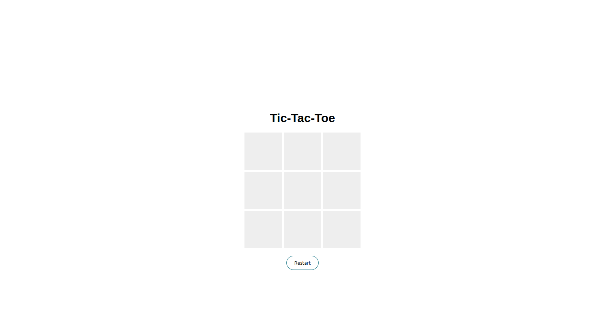

# 🌐 m223rx – Tic-Tac-Toe Web Game 

---

## 🚀 Features  

- **Modern, Responsive Design**
Built with clean HTML, CSS, and JS to look great on desktop and mobile.

- **Interactive Gameplay**
Click on any cell to place your X or O, alternating turns between two players.

- **Win Detection**
Automatically detects when a player wins or if the game ends in a draw.

- **Restart Button**
Quickly reset the board and start a new game with one click.

- **Smooth UI Interactions**
Hover effects on cells for better feedback, clear win notifications.

---

## 🛠 Tech Stack

- **Frontend:**
  - [HTML5](https://developer.mozilla.org/en-US/docs/Web/HTML) – semantic structure  
  - [CSS3](https://developer.mozilla.org/en-US/docs/Web/CSS) – styling  
  - [JavaScript](https://developer.mozilla.org/en-US/docs/Web/JavaScript) – game logic & dynamic content

- **Deployment:**
  - Works perfectly with [GitHub Pages](https://pages.github.com/), [Netlify](https://www.netlify.com/), or any static hosting service.

---

## ⚡ Usage

1. **Clone the repository:**

   git clone https://github.com/m223rx/tic-tac-toe-web-app.git

   cd tic-tac-toe-web-app

2. **Open index.html in your browser**

3. **Customize content**

    Update styles in style.css for colors, fonts, and layout tweaks.

    Edit cell hover effects or game board layout in CSS.

4. **Restart & Play:**

    Use the restart button to reset the game anytime.

5. **Deploy:**

    Push to GitHub and enable GitHub Pages or upload to your hosting platform.

## 🎨 Customization

Change colors, fonts, and spacing in style.css to match your brand or theme.

Add animations for cell clicks or win notifications using CSS transitions.

Replace screenshots in assets/screenshots/ with your own images.

## 💡 Future Enhancements

Single-player mode vs computer (AI logic).

Highlight winning line when a player wins.

Scoreboard to track multiple rounds.

Mobile-first improvements and accessibility features.

Add sound effects for clicks, wins, and draws.

## 👨‍💻 Developer
m223rx – 2025

© 2025 m223rx. All rights reserved.

---